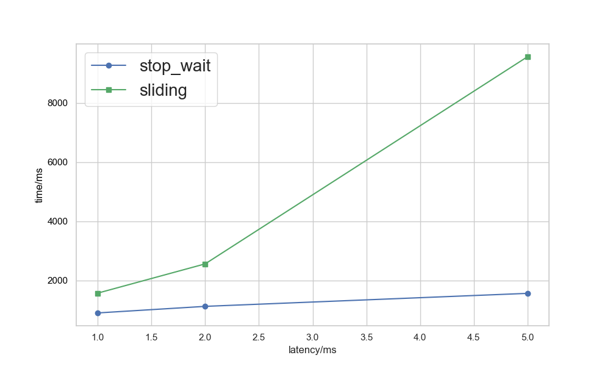
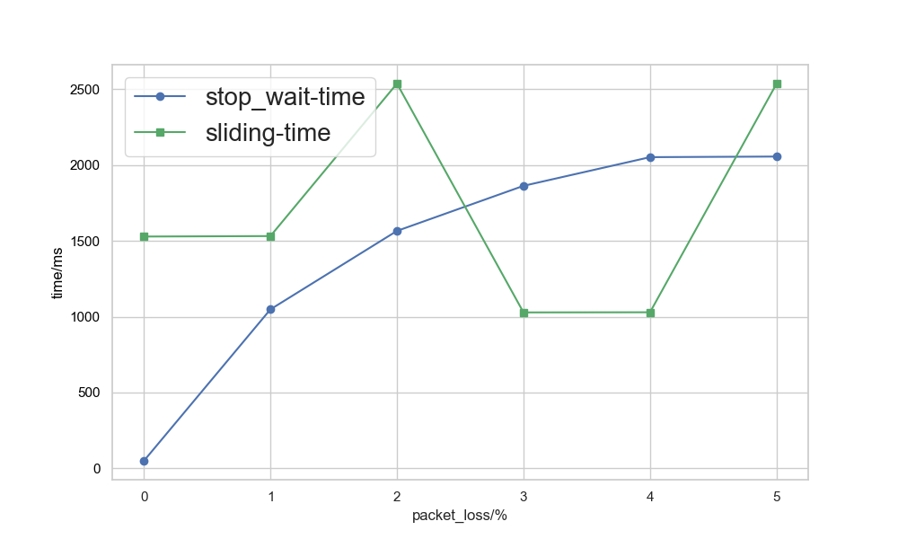
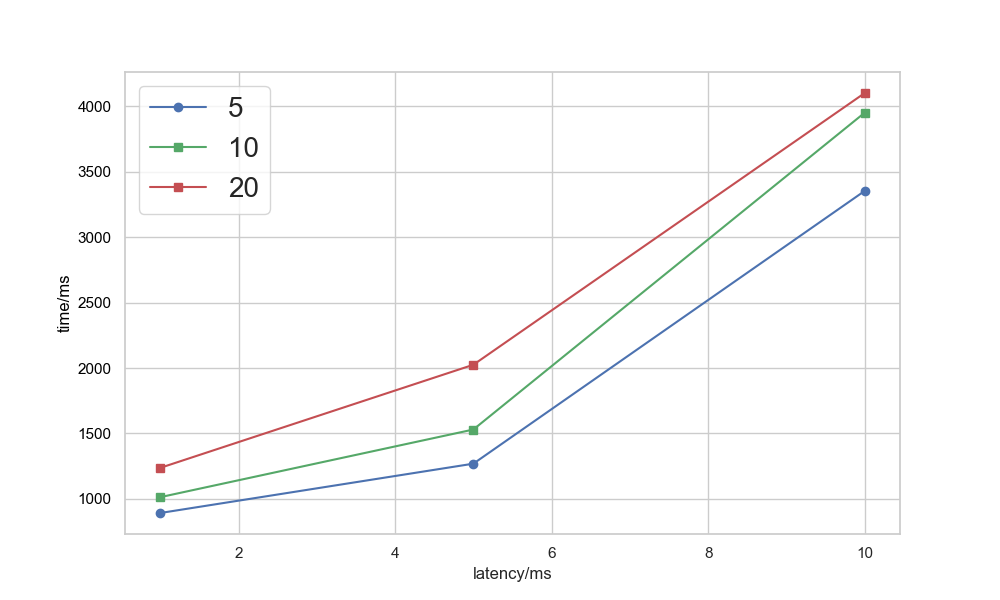
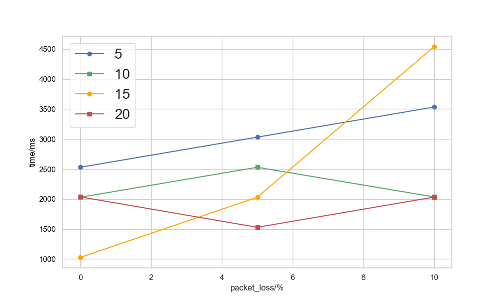
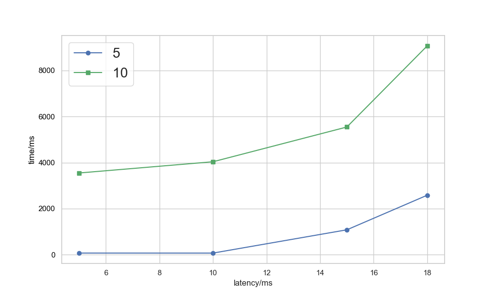
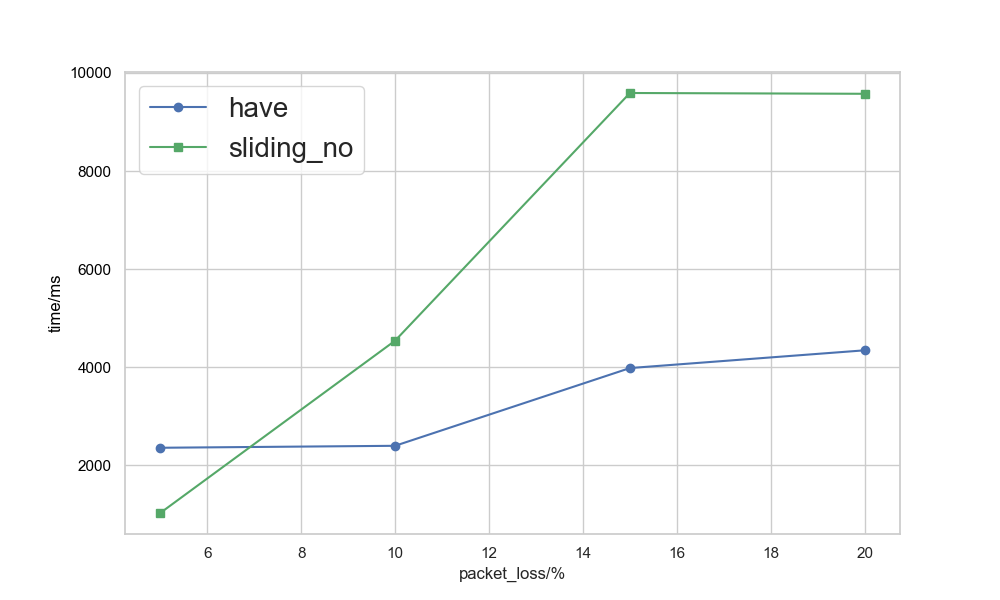

# **基于UDP服务设计可靠传输协议并编程实现**
李娅琦  
2213603  
计算机科学与技术  
## **实验要求**
于给定的实验测试环境，通过改变网络的延迟时间和丢包率，完成下面3组性能对比实验：

- 停等机制与滑动窗口机制性能对比
- 滑动窗口机制中不同窗口大小对性能的影响
- 有拥塞控制和无拥塞控制的性能比较

通过完成给定测试文件的传输，显示传输时间和平均吞吐率，并给出图形结果并进行分析。

## **实验设置**
- 实验代码基于前三次实验
- 延时丢包由程序实现，不使用路由
- 实验采用控制变量法,数据进行三次测试取平均值
- 传输文件: 使用 1.jpg 图片进行测试

由于之前的**clock（）** 测量只能精确到秒或者几千毫秒，因此为了更精确地测量到毫秒，使用 **chrono** 提供的高精度计时功能：

```c++
auto start = chrono::high_resolution_clock::now();
sendfile(buffer, len, false);
auto end = chrono::high_resolution_clock::now();
auto duration = chrono::duration_cast<chrono::milliseconds>(end - start).count();
// 输出结果
cout << "\033[1;36mOut:\033[0m 传输总时间为: " << duration << " ms" << endl;
cout << "\033[1;36mOut:\033[0m 吞吐率为: "<< fixed << setprecision(2)<< (static_cast<double>(len) / duration) << " byte/ms" << endl;
```

## **停等与滑动窗口**
- 滑动窗口大小固定为：15
- 分别改动延时和丢包率进行对比
### 不同延时
控制丢包率为0，改变时延，结果如下：
| 延时  | 1      | 2      | 5      |
|--------|--------|--------|--------|
| 停等-time /ms   | 904     | 1126   | 1565   |
| 停等-吞吐率 byte/ms| 2054.59 | 1526.34 | 1186.81 |
| 滑动-time /ms   | 1573   | 2561   | 9557   |
| 滑动-吞吐率 byte/ms| 1094.02 | 794.26 | 194.34 |



- 停等机制在低延迟下表现较好，能够提供高吞吐率。当延迟增加时，时间变长和吞吐率下降
- 滑动窗口机制在延迟增加时，时间显著上升，特别是在高延迟情况下，吞吐率也显著下降
- 滑动窗口机制在时间性能方面可能无法与停等机制相抗

这可能是因为滑动窗口采用GBN, 数据报丢失后出现一个数据包多次重发的现象,导致滑动窗口机制不如停等机制.
### 不同丢包率
控制时延为0，改变丢包率，得到的数据和折线图结果如下：

| 丢包率  | 0      | 1      | 2      | 3      | 4      | 5      |
|--------|--------|--------|--------|--------|--------|--------|
| 停等-time /ms   | 50     | 1048   | 1565   | 1862   | 2051   | 2055   |
| 停等-吞吐率 byte/ms| 37147.06 | 1772.28 | 1186.81 | 1021.63 | 905.58 | 903.82 |
| 滑动-time /ms   | 1528   | 1531   | 2536   | 1028   | 1029   | 2535   |
| 滑动-吞吐率 byte/ms| 1215.55 | 1213.16 | 732.39 | 1806.76 | 1805.01 | 732.68 |



对比两种机制在不同丢包率条件下的时间和吞吐率性能可以得出以下:

- 停等机制时间增长明显：
  - 在丢包率较低时，停等机制的时间较短
  - 随着丢包率增加，停等机制的时间大幅增长，显示出对丢包的敏感性
- 滑动窗口时间相对稳定：
  - 滑动窗口的时间波动较小
  - 但在高丢包率情况下，滑动窗口机制时间显著增加，但增长幅度仍小于停等机制。
- 在低丢包率情况下，停等机制效率高于滑动窗口。
- 在高丢包率情况下，滑动窗口的时间性能更稳定，且增长趋势较缓
- 停等机制低丢包率吞吐率优于滑动窗口，但对丢包极为敏感，性能下降严重
- 滑动窗口机制在丢包率增加时，吞吐率下降较缓，性能更稳定


因此,停等机制适合在低丢包率、理想网络环境下的应用场景，例如小型文件传输; 滑动窗口机制更适合在高丢包率或复杂网络环境下的应用场景，例如长距离传输或者高丢包率网络（如无线通信）
## **不同窗口大小**
### 不同延时
控制丢包率为0，改变时延，结果如下：
| 延时 | 1     | 5     | 10      |
|--------|--------|--------|--------|
| 5   | 892/2106.62 | 1269/1565.37 | 3354/562.15 |
| 10 | 1013/1915.74 | 1530/1214.13 |3952/503.61 |
| 20 | 1237/1612.26 | 2025/899.56 | 4102/493.40 |



分析可知，当窗口比较小时，性能比较好，而当窗口逐渐增大后，性能会下降，但增大到一定程度，继续增大窗口，性能又会有所提升.
### 不同丢包率
控制时延为0，改变丢包率，得到的数据和折线图结果如下(其中数据表示: 时间/吞吐率 )：
| 丢包率  | 0     | 5     | 10      |
|--------|--------|--------|--------|
| 5   | 2531/733.84 | 3032/612.58   | 3534/525.57 |
| 10 | 2031/914.50 | 2530/734.13 |2036/912.26 |
| 15   | 1028/1806.76   | 2030/914.95 | 4541/409.02 |
| 20 | 2036/912.26 | 1529/1214.75 | 2033/913.60 |



分析可知:
- 低丢包率下，较小的窗口（如窗口大小为 5）表现出更低的延迟，但吞吐率稍低。
- 高丢包率时，窗口大小较大的情况（如窗口大小为 10）往往能提供较为稳定的吞吐率，并且在时间性能上有所提升，但也伴随吞吐率的下降。
- 窗口大小较大的设置在丢包率增加时能够提供相对较好的适应性
  - 在较高丢包率下，窗口大小为 10 时的表现更为稳定

这种情况的出现, 可能是因为: 如果一个包丢失，那么在发送缓冲区中后面发送的包都是无意义的，所以窗口越大，一旦数据报丢失， 要重发的数据报就越多，这就导致了窗口变大，性能反而下降

## **拥塞控制的有无**
### 不同延时
控制丢包率为0，改变时延，结果如下：
| 延时 (ms) | 5       | 10       | 15       | 18       |
|-----------|---------|----------|----------|----------|
| 有/时间 ms   | 69      | 68       | 1079     | 2581     |
| 有/吞吐率  byte/ms | 26918.16 | 27314.01 | 1721.37  | 719.63   |
| 无/时间 ms  | 3547    | 4035     | 5544     | 9068     |
| 无/吞吐率  byte/ms | 523.64  | 460.31   | 335.02   | 204.82   |



分析可得:
- 在有拥塞控制的情况下
  - 丢包数量显著低于无拥塞控制
  - 吞吐量下降更快  
  这说明拥塞控制机制更倾向于保护网络资源（减少丢包），但牺牲了一定的吞吐率
- 在无拥塞控制的情况下
  - 丢包数量随延时显著增加
  - 吞吐量一直保持较低水平
  - 显示了网络资源浪费
- 有拥塞控制时间性能更稳定，尤其在低延时环境下
- 无拥塞控制在低延时时性能较差，高延时下传输时间更差

这可能是因为: 有拥塞控制时，时延大时RENO算法会有快速重传，使性能得到提升，并且会自动下调
窗口大小，避免超时后需要重传的过多.
### 不同丢包率
控制时延为0ms，滑动窗口大小为15，改变丢包率，比较有无拥塞控制，得到的数据和折线图结果如下：

| 丢包 (%)  | 5       | 10       | 15       | 20       |
|-----------|---------|----------|----------|----------|
| 有/时间 ms       | 2358    | 2398     | 3983     | 4345     |
| 有/吞吐率  byte/ms  | 787.68  | 774.54   | 466.32   | 427.47   |
| 无/时间 ms  | 1028    | 4541     | 9591     | 9575     |
|  无/吞吐率  byte/ms | 1806.76  | 409.02   | 193.66   | 193.98   |



分析可得:
- 在有拥塞控制的情况下
  - 时间随丢包比例的增加而上升
  - 表明拥塞控制机制会主动降低传输速率以适应网络状态
- 在无拥塞控制的情况下
  - 无拥塞控制导致**重传次数大幅增加**，显著拉长传输时间
  - 说明网络过载时无法主动调节导致性能恶化
- 有拥塞控制的时间性能更稳定
- 无拥塞控制在低丢包率时表现较好，但在高丢包率下时间性能显著恶化

这可能是因为: 无拥塞控制时，窗口大小固定，随着丢包率增大性能降低；而有拥塞控制时，丢包率
大时RENO 算法会自动下调窗口大小，使性能得到提升.

因此,可以总结如下:

| **维度**         | **有拥塞控制**                             | **无拥塞控制**                             |
|------------------|-------------------------------------------|-------------------------------------------|
| **丢包适应性**    | 主动调节发送速率，对丢包有较强适应能力      | 无法适应丢包，重传次数多，网络负载高        |
| **延时适应性**    | 能适应不同延时条件，动态调节速率             | 对延时非常敏感，无法有效应对延时增长         |
| **适用场景**      | 适用于高丢包率、延时变化较大的复杂网络环境  | 适用于低丢包率、短时间、传输延时较低、网络环境理想的场景  |

### **总结**
停等机制与滑动窗口机制在不同网络环境下表现各异。停等机制在低延迟和丢包率较低的环境中表现优异，但对丢包和延迟的适应性较差，性能容易受到影响。滑动窗口机制则在较复杂的网络环境中表现更稳定，能够较好地应对延迟和丢包，吞吐率虽然较低，但在高延迟或丢包情况下性能下降幅度较小。

相较之下，启用拥塞控制可以显著提高网络的稳定性，避免过载和过多丢包，适用于更复杂的网络环境，而无拥塞控制的情况下，吞吐率和稳定性较差，容易受到网络条件波动的影响。